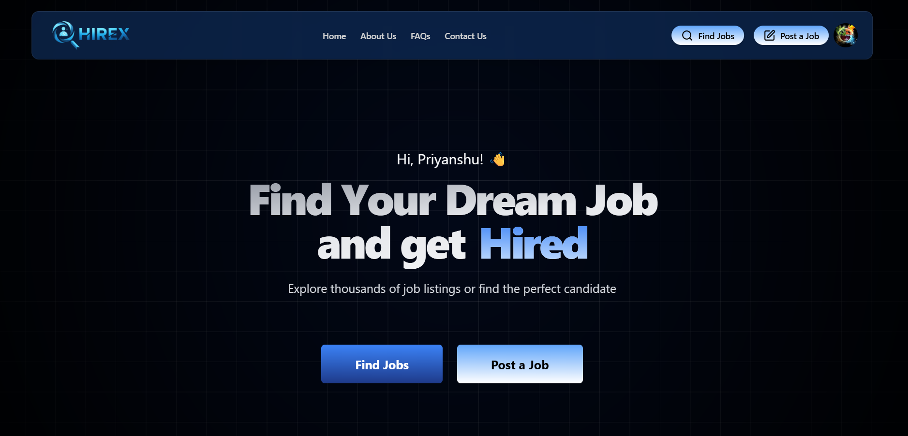
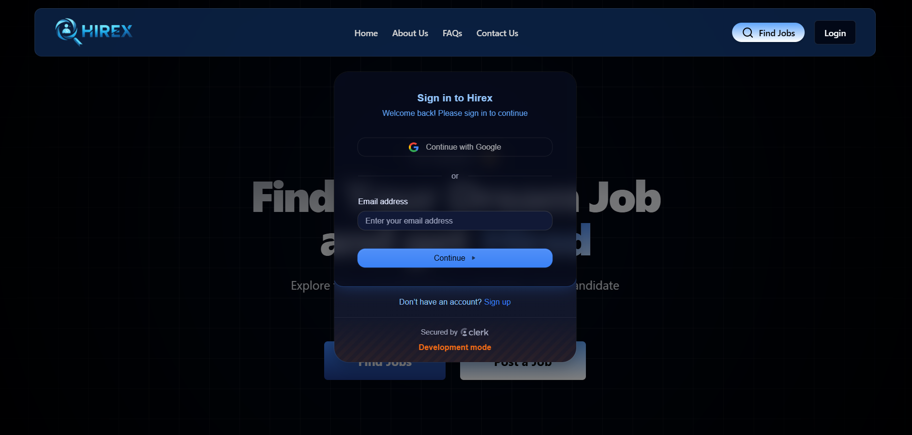
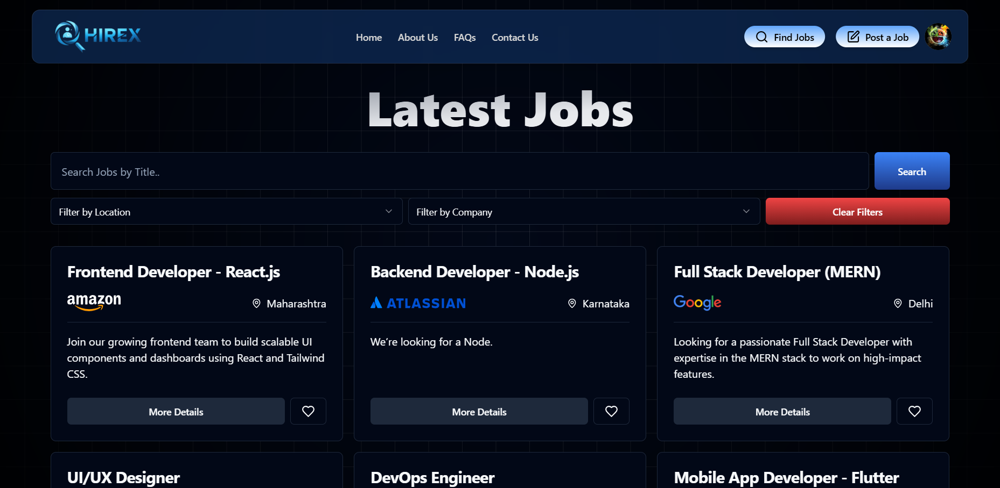

# 🧑‍💼 HireX - Job Portal Web App

A modern full-stack **Job Portal** built with React.js, Tailwind CSS, Supabase, Clerk Authentication, and Shadcn UI. This platform allows users to explore job listings, save jobs, and apply seamlessly.

---

## 🔧 Tech Stack

- **Frontend:** React.js (Vite), Tailwind CSS
- **Auth:** Clerk (email/password, Google, etc.)
- **Database:** Supabase (PostgreSQL)
- **UI Components:** Shadcn UI
- **State & Hooks:** React Hooks, Custom Hooks
- **Icons:** Lucide Icons
- **Deployment:** Vercel

---

## 🚀 Features

- 🔐 Secure Authentication with Clerk
- 📄 Job Posting & Description Pages
- ❤️ Save/Unsave Jobs
- 📍 Location Picker using Country-State-City API
- 🖼️ Company Logo Upload (with Supabase Storage)
- ✍️ Markdown Editor for Job Requirements
- 🔎 Filter/Search Jobs by Location, Type, etc.
- 🧑‍💼 Recruiter Dashboard 

---

  
  
  

